

  <!-- TODO: logo / title-screen image -->

# Zork I for the Sega Saturn: English and NetLink

A Z-machine for the Sega Saturn, built onto the Japan-only Saturn release of <a href='https://en.wikipedia.org/wiki/Zork_I'>Zork I: The Great Underground Empire</a>.

## Table of Contents
1. [Overview](#Overview)
1. [Screenshots](#Screenshots)
1. [About the Game](#About-the-Game)
1. [Patching Instructions](#Patching-Instructions)
1. [Controls](#Controls)
1. [Playing Online](#Playing-Online)
1. [Helpful Tips](#Helpful-Tips)
1. [Credits & Special Thanks](#Credits)
1. [Reporting Issues](#Reporting-Issues)
1. [Release Changelog](#Release-Changelog)

## **Overview**

You are standing in an open field west of a white house, with a boarded front door.

There is a small mailbox here.

In 1996, Arc System Works and Shoeisha gave that field a picture: a fully illustrated, fully scored Zork I for the Sega Saturn, with art for its rooms and a CD soundtrack by Yuzo Koshiro and Motohiro Kawashima. It never left Japan, and it was only ever Zork I.

I poked around in the original disc and did find English menus, but sadly most of the interpreter mechanisms work purely from Japanese sentence structure and it became a task of futility to translate.

  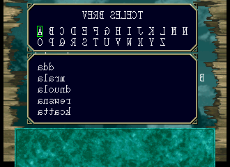

So instead, I ported a Z-machine interpreter to the Saturn and built it around the disc's own art and music, which show how well made the Japanese release of Zork is.

## 
...This patch keeps everything that disc did well and puts a real Z-machine underneath it. The original logos, opening movie and title screen still play. Press Start, and when the door opens, the new Z-machine takes over.

From the original disc:

- All 74 room backgrounds, read straight off your own disc
- All 19 inventory item pictures
- All 13 animated area borders
- All 31 CD audio tracks

### A command menu built from the ground up

No keyboard needed. The command panel builds every sentence from words the game itself understands:

- **A dynamic verb menu** that ranks verbs by what's on screen right now, so the verb you need is usually already in reach
- **Word lists** decoded from each game's own dictionary when it loads, so any Z3 game works, not just Zork
- **A compass rose** that shows which exits are open before you try them
- **Your inventory** as a picture overlay, using the original disc's item art
- An A-Z index for everything else, and the Saturn keyboard and mouse if you'd rather type

### Easy, Medium and Hard

- **Easy:** the full map from the start, and suggestions that nudge you toward the winning move
- **Medium:** the map fills in as you explore, and suggestions come from the game's vocabulary
- **Hard:** no map and no suggestions, just you and the parser, the way Infocom intended

And on top:

- All 31 Z3 stories: every Infocom version-3 game, plus Colossal Cave Adventure
- Lurking Horror's sound effects, heard before only in its Amiga and Atari ST rereleases
- A netbin version you can launch straight from the Saturn's NetLink browser, no disc required
- NetLink multiplayer: up to four players in one game, over a real modem and a DreamPi
- An in-game map with quick travel
- A command panel and on-screen keyboard, so the whole game plays on a controller; the Saturn keyboard and mouse work too
- Saves to the Saturn's backup memory
- A synth soundtrack for every game that isn't Zork I, much of it built in Ableton Live

## **Screenshots**

<table>
  <tr><th>Original disc</th><th>This patch</th></tr>
  <tr><td>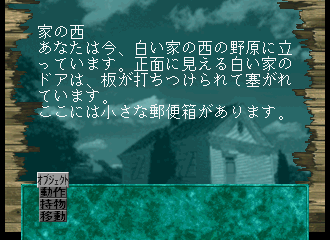</td><td>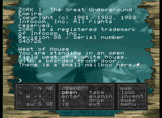</td></tr>
  <tr><td>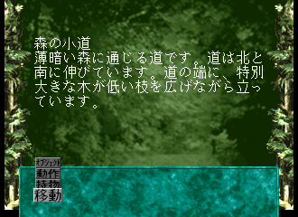</td><td>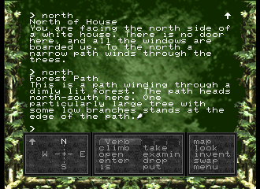</td></tr>
  <tr><td>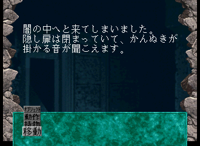</td><td>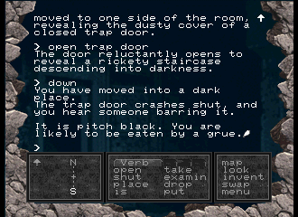</td></tr>
  <tr><td>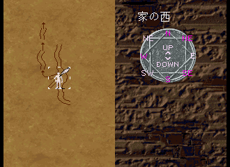</td><td>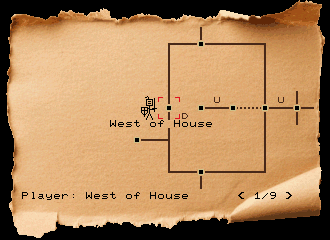</td></tr>
</table>

  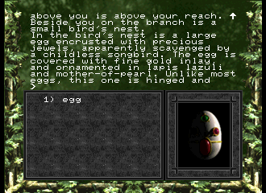

The text screen can take the colours of an old microcomputer. The **Display** page in the pause menu has sixteen presets, from the IBM PC's green on black and the Apple II Plus to the AmigaOS blue, the Commodore 64 and the ZX Spectrum, or you can pick the background and text colours yourself.

  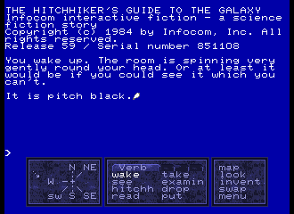

## **About the Game**

<table>
  <tr><td><strong>Original Title</strong></td><td>Zork I: The Great Underground Empire</td></tr>
  <tr><td><strong>Developer</strong></td><td>Arc System Works</td></tr>
  <tr><td><strong>Publisher</strong></td><td>Shoeisha</td></tr>
  <tr><td><strong>Original Release Date</strong></td><td>1996-03-15</td></tr>
  <tr><td><strong>Music</strong></td><td>Yuzo Koshiro, Motohiro Kawashima</td></tr>
</table>

## **Patching Instructions**

You need your own copy of *Zork I - The Great Underground Empire (Japan)*, Redump T-21502G V1.001: one `.cue` and 32 `.bin` files. The patch carries none of the original disc and does nothing without it.

### XDelta ###

1. Grab an XDelta patcher like <a href='https://www.romhacking.net/utilities/704/'>Delta Patcher</a>
2. Unzip the patch bundle
3. For the Original File, pick <kbd>Zork I - The Great Underground Empire (Japan) (Track 01).bin</kbd>
4. Pick <kbd>zork1-english-netlink.xdelta</kbd> and click **'Apply Patch'**
5. Keep using the same `.cue`. Only Track 01 changes.

### Sega Saturn Patcher ###

1. Open the original `.cue` in Sega Saturn Patcher
2. Pick <kbd>zork1-english-netlink.ssp</kbd>
3. Outside Japan, tick **Region Free**
4. Patch

### Adding the other stories ###

The patch ships with Zork I, II and III, the three that Microsoft released as open source. To add the rest, **double-click <kbd>add-additional-games.bat</kbd>**, or run `./add-additional-games.bat` on macOS or Linux. It finds your patched Track 01 next to the patch folder, or asks you to pick it, then downloads the stories and Lurking Horror's sound effects and adds them to the disc. macOS and Linux need `xorriso` installed.

## **Controls**

Every button can be remapped under **Options → Controls**. These are the defaults.

### Control Pad ###

<table>
  <tr><td><strong>A</strong></td><td>Accept: send the command</td></tr>
  <tr><td><strong>B</strong></td><td>Backspace / Cancel</td></tr>
  <tr><td><strong>C</strong></td><td>Type the highlighted word or letter</td></tr>
  <tr><td><strong>X</strong></td><td>Map</td></tr>
  <tr><td><strong>Y</strong></td><td>Space</td></tr>
  <tr><td><strong>Z</strong></td><td>Swap between the command panel and the keyboard</td></tr>
  <tr><td><strong>Start</strong></td><td>Pause menu</td></tr>
  <tr><td><strong>L + Up/Down</strong></td><td>Recall earlier commands</td></tr>
  <tr><td><strong>L + Left/Right</strong></td><td>Autocomplete</td></tr>
  <tr><td><strong>R + Up/Down</strong></td><td>Scroll a line</td></tr>
  <tr><td><strong>R + Left/Right</strong></td><td>Scroll a page</td></tr>
  <tr><td><strong>Hold L + R</strong></td><td>Hang up when playing online</td></tr>
</table>

Any button skips the text while it's writing itself out.

### Saturn Keyboard ###

Type as normal, **Enter** to send, **Backspace** to delete.

<table>
  <tr><td><strong>F2</strong></td><td>Save, choosing the slot</td></tr>
  <tr><td><strong>F3</strong></td><td>Restore, choosing the slot</td></tr>
  <tr><td><strong>F5</strong></td><td>Quick save to the last slot used</td></tr>
  <tr><td><strong>F6 / F9</strong></td><td>Quick restore from the last slot used</td></tr>
  <tr><td><strong>F8</strong></td><td>Map</td></tr>
  <tr><td><strong>F10 / Esc</strong></td><td>Pause menu</td></tr>
  <tr><td><strong>F11</strong></td><td>Keyboard controls</td></tr>
  <tr><td><strong>F12</strong></td><td>Sound options, when the game has music or sound</td></tr>
</table>

Online, only **F8** for the map works, and **Esc** hangs up.

### Saturn Mouse ###

**Click** a word or letter to type it, **right-click** to send, **middle-click** to backspace. Click the map button for the map, click the prompt to recall your last command, and click the scroll arrows to scroll (right-click for a page, middle-click for the top or bottom).

### 3D Control Pad ###

The analogue stick works as a mouse: it moves an on-screen cursor, whatever the cursor points at is highlighted, and the usual buttons act on it. Everything else matches the Control Pad above. Under **Options → Controls**, the **Mouse** row switches the cursor between the **3D Stick** (default), the **D-Pad**, or **Off**.

The Mission Stick's stick moves the cursor the same way.

## **Playing Online**

- **From the disc:** choose Play Online. It dials `199408` through a NetLink modem into a DreamPi.
- **No disc needed:** in the PlanetWeb 4.0 browser, go to `https://suinevere.duckdns.org/zork`.

Tested on DreamPis through a <a href='https://web.archive.org/web/20190721003219/http://neinnovations.com/hint004.html'>Northeast Innovations phone line simulator</a>, and through the official DreamPi modem with line emulation.

## **Helpful Tips**

- **Start** opens the pause menu: the map, save, load and options. Your score, moves and current room are shown under it.
- **In the online lobby,** press **B** on an empty line to refresh the list of open games.
- **If Play Online fails to connect,** check the dial number on the Network page. Older versions saved `199403`, which no longer works.

## **Credits**

**MojoZork & multizorkd**
- MojoZork written by Icculus (Ryan C. Gordon), zlib license (`saturn/LICENSE.txt`)

**Synth Soundtrack**
- The original tracks, including Le Vent, were built in Ableton Live
- "Fanfare 03" and "Swamp 02" by Beau Buckley (<a href='https://opengameart.org/content/fanfare-03'>Fantasy Musica</a>), CC-BY-SA 4.0
- "No One" by <a href='https://opengameart.org/content/original-midi-album'>roppychop</a>, CC0
- "Harpsichord Flurry" by Julie Damsgaard (<a href='https://opengameart.org/content/harpsichord-flurry'>Spring Spring</a>), CC0

**Special Thanks**
- ReyeMe and contributors, for SaturnRingLib
- eaudunord, for the Netlink tunnel
- Andrew Plotkin, for the Obsessively Complete Infocom Catalog
- Kevin Bracey, for the Lurking Horror sound files
- Will Crowther and Don Woods for Colossal Cave Adventure, and Jeff Nyman for its Z3 port
- Arc System Works and Shoeisha, and Yuzo Koshiro and Motohiro Kawashima, for the disc this is built on
- archive.org, for hosting the asset backups
- Every Infocom implementer (the full list is in-game under Credits)

Zork I, II and III are Infocom / Activision, MIT-licensed by Microsoft (saturn/game-licenses). The bundled `xorriso` and `iso2raw` are GPLv3 (tools/assets/bin/README.md).

## **Reporting Issues**

Found a bug, a freeze or a mistyped room? [Open an issue here](https://github.com/suinevere/zaturn-releases/issues/new). The grue is under investigation.

## **Release Changelog**

- **Version 1.0.0 (10/5/2026)**
  - Initial release

